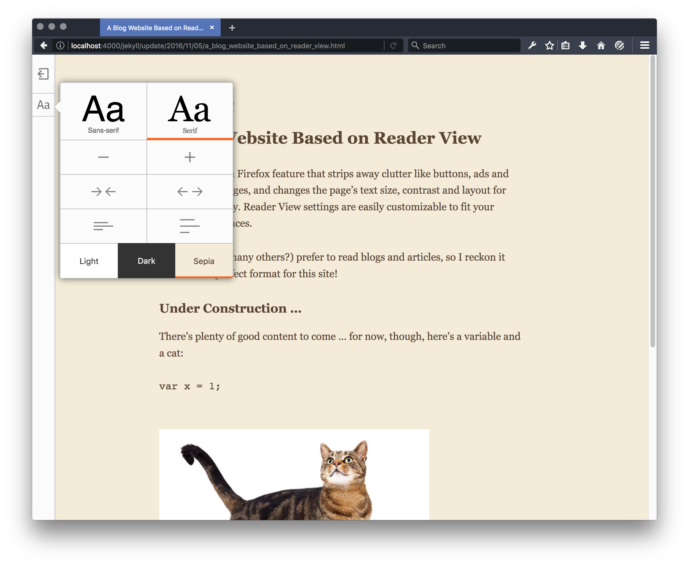

# tabreturn.github.io
A Jekyll theme based on the Firefox Reader View, for a clean, clear,
customisable blog interface.

## todo:
* cursor:pointer for all links/buttons
* home link
 * white hover state for home icon (and change icon?)
 * create link
* landing page with:
 * ~listing by year~
 * ~tags~
 * search/filter (tags and topics) ?
* comments
 * global config
 * front-matter condition for showing comments
 * customise/style comments (isso config options as well)
 * rudimentary captcha?
* add favicon
